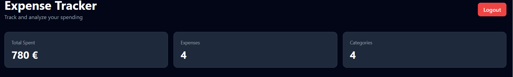
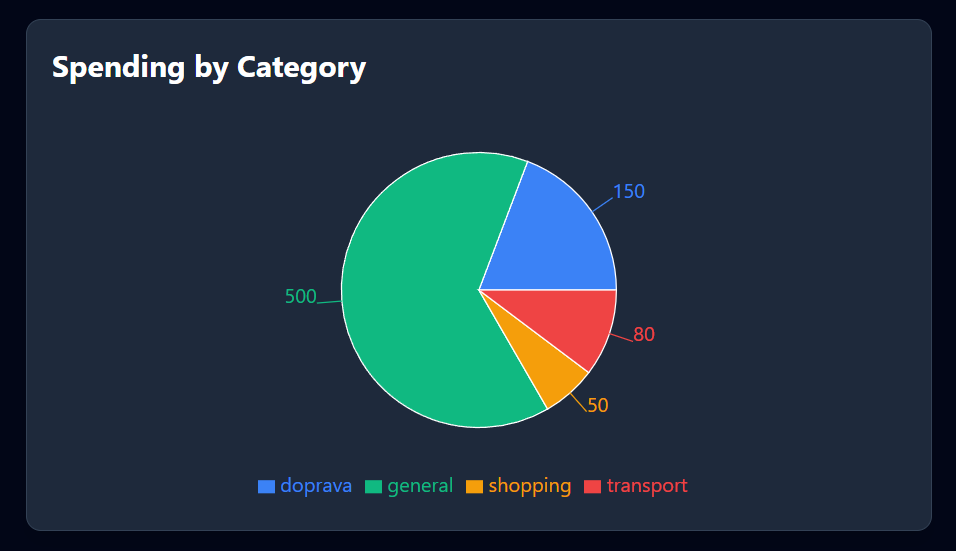
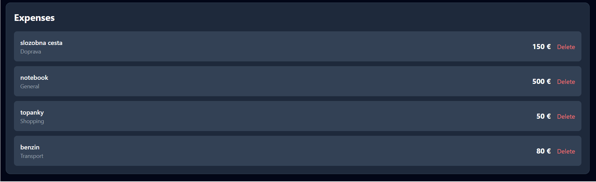
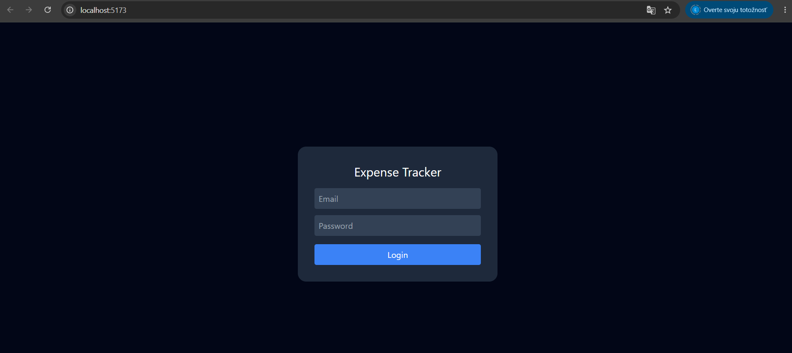

# Expense Tracker

Full-stack expense tracking application built with React and FastAPI.

## Features

- JWT Authentication
- Expense Management
- Category Analytics
- Interactive Dashboard
- PostgreSQL Database
- REST API
- Responsive UI
- Cloud Deployment

## Tech Stack

Frontend:
- React
- Tailwind CSS
- Axios
- Recharts

Backend:
- FastAPI
- SQLAlchemy
- PostgreSQL
- JWT
- Alembic

## Screenshots

- Dashboard

- Analytics

- Expense List

- Authentication

## Live Demo

Frontend:
...

Backend:
https://jwt-auth-api-2-6oo7.onrender.com

## Installation

...